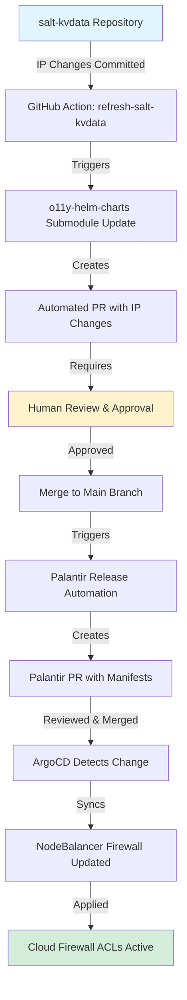
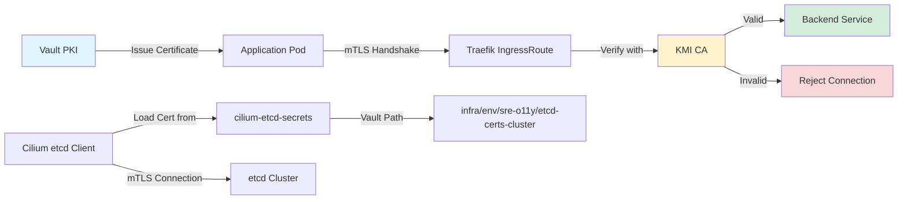
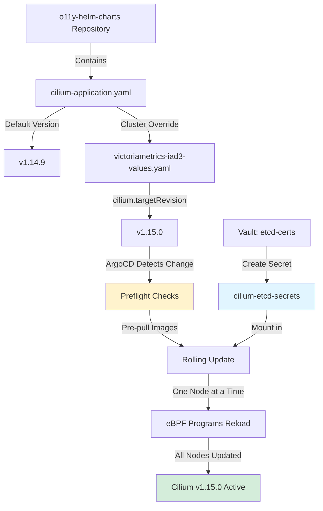

# O11y Kubernetes Clusters - Security Controls Documentation

## Overview

This document provides comprehensive documentation on the security controls implemented across observability (o11y) Kubernetes clusters. The security architecture follows a defense-in-depth approach with multiple layers of protection.

## Table of Contents

1. [Security Architecture Overview](#security-architecture-overview)
2. [Cilium Firewall (Container Network Interface)](#cilium-firewall-container-network-interface)
3. [Cloud Firewall (NodeBalancer Layer)](#cloud-firewall-nodebalancer-layer)
4. [mTLS Implementation](#mtls-implementation)
5. [Security Control Matrix](#security-control-matrix)
6. [Diagrams](#diagrams)

---

## Security Architecture Overview

The o11y Kubernetes clusters implement a multi-layered security architecture:

### Defense-in-Depth Layers

1. **Layer 4 (Network Edge)**: Cloud Firewall on NodeBalancers
2. **Layer 3 (Container Network)**: Cilium Network Policies
3. **Layer 7 (Application)**: mTLS and Application-level Authentication

### Key Security Principles

- **Least Privilege**: Only necessary traffic is permitted
- **Separation of Concerns**: Nodes use Cilium, NILs (Network Internet Listeners) use Cloud Firewall
- **Zero Trust**: mTLS for service-to-service communication
- **Defense-in-Depth**: Multiple security layers

---

## Cilium Firewall (Container Network Interface)

### Purpose

Cilium serves as the primary Container Network Interface (CNI) for all o11y Kubernetes clusters, providing:
- Network policy enforcement
- Transparent encryption between pods
- eBPF-based packet filtering
- ICMP traffic control

### Scope

**Applied to**: All cluster nodes (internal pod-to-pod and pod-to-service communication)

### Key Features

#### 1. Network Policy Enforcement
- eBPF-based enforcement at the kernel level
- Low overhead, high performance
- Granular control over pod communication

#### 2. Transparent Encryption
- Automatic encryption of inter-pod traffic
- No application changes required
- Available in Cilium 1.4+

#### 3. ICMP Network Policies
- Allows/denies ICMP traffic (ping, traceroute)
- Recently implemented for debugging purposes

### Configuration

#### Version Management
- **Current Version**: v1.14.9 (default)
- **Configuration Location**: `o11y-helm-charts` repository
- **Cluster-Specific Overrides**: Set via `cilium.targetRevision` in cluster values files

Example:
```yaml
# In cluster values file (e.g., victoriametrics-iad3-us-staging)
cilium:
  targetRevision: v1.15.0
```

#### Deployment Architecture
```
o11y-helm-charts (Helm Chart)
    ↓
ArgoCD Application (cilium-application.yaml)
    ↓
Cluster Deployment (kube-system namespace)
    ↓
eBPF Programs Loaded on All Nodes
```

### Upgrade Process

**CRITICAL**: Cilium upgrades must follow strict procedures:

1. **Preflight Checks**: Run before any upgrade to pre-pull images
2. **Version Constraints**: Only upgrade one minor version at a time
   - ✅ Valid: v1.14.x → v1.15.x
   - ❌ Invalid: v1.14.x → v1.16.x
3. **Secret Requirements**: `cilium-etcd-secrets` must exist in `kube-system` namespace

### etcd Integration

Cilium requires etcd for distributed state management:

**Secret Location**: Vault path `infra/[env]/sre-o11y/etcd-certs-[cluster-name]`

**Kubernetes Secret**: `cilium-etcd-secrets` in `kube-system` namespace

Contents:
- `etcd-client-ca.crt`
- `etcd-client.crt`
- `etcd-client.key`

### Network Policy Examples

#### Allow ICMP Traffic
```yaml
apiVersion: cilium.io/v2
kind: CiliumNetworkPolicy
metadata:
  name: allow-icmp
spec:
  endpointSelector:
    matchLabels: {}
  ingress:
  - icmps:
    - type: 8  # Echo Request
```

### Reference Documentation

- Upgrade Guide: `docs/content/Services/Kubernetes Clusters/cilium-upgrade.md`
- ClusterMesh Proposal: `docs/content/proposals/OP-07-cilium-clustermesh.md`

---

## Cloud Firewall (NodeBalancer Layer)

### Purpose

Cloud Firewall (CFW) provides Layer 4 firewall protection at the NodeBalancer level, controlling which external traffic can reach cluster services.

### Scope

**Applied to**: NILs (Network Internet Listeners) - LoadBalancer services exposed to external traffic

**Current Deployment**:
- Global-select clusters: CFW enabled
- LTS clusters: Uses `vminsertAllowlist` (staging only currently)

### Architecture

Cloud Firewall is managed by the Cloud Controller Manager (CCM) via Kubernetes service annotations.

```
External Traffic
    ↓
NodeBalancer with Cloud Firewall
    ↓ (ACL Filtering)
Kubernetes LoadBalancer Service
    ↓
Backend Pods
```

### Configuration

#### Annotation-Based Setup

```yaml
apiVersion: v1
kind: Service
metadata:
  name: victoriametrics-vminsert
  annotations:
    service.beta.kubernetes.io/linode-loadbalancer-firewall-acl: |
      {
        "allowList": {
          "ipv4": ["192.166.0.0/16", "172.23.41.0/24"],
          "ipv6": ["2001:DB8::/128"]
        }
      }
spec:
  type: LoadBalancer
  ports:
  - port: 8480
    protocol: TCP
```

#### ACL Rules Constraints

- **Maximum Rules**: 5 per service
- **IPs per Rule**: Up to 255 IPs/networks
- **Rule Types**: Either `allowList` OR `denyList` (not both)
- **Port Configuration**: Automatically derived from service spec

### IP Allowlist Management

The observability team uses an automated pipeline for managing IP allowlists:

#### Data Flow

```
salt-kvdata repository (Source of Truth)
    ↓
GitHub Action: refresh-salt-kvdata.yaml
    ↓
o11y-helm-charts submodule update
    ↓
Automated PR with IP changes
    ↓
Human Review (Safety Gate)
    ↓
Palantir Release Automation
    ↓
ArgoCD Sync
    ↓
NodeBalancer Firewall Updated
```

#### Configuration Sources

1. **salt-kvdata**: Primary IP allowlist data
2. **salt-kvdata-collected**: Aggregated IP data
3. **Helm Variables**: Transform IPs into list format
4. **Cluster Values**: Reference specific kvdata files
5. **Traefik Annotations**: Apply firewall rules to services

#### Example Use Cases

- Remote-write from Kubernetes Prometheus nodes
- VictoriaMetrics cluster-to-cluster communication
- All cluster nodes added to VictoriaMetrics firewalls

### Firewall Rule Examples

#### Allow Specific Clusters
```json
{
  "allowList": {
    "ipv4": [
      "172.23.41.0/24",    // victoriametrics-iad3-us-staging
      "172.23.42.0/24",    // victoriametrics-lax3-us-prod
      "192.166.0.0/16"     // Internal networks
    ]
  }
}
```

#### Allow Regional Clusters
```json
{
  "allowList": {
    "ipv4": [
      "172.23.41.0/24",    // iad3
      "172.23.42.0/24",    // lax3
      "172.23.43.0/24",    // ord2
      "172.23.44.0/24",    // mad2
      "172.23.45.0/24",    // sto2
      "172.23.46.0/24",    // osa1
      "172.23.47.0/24",    // cgk1
      "172.23.48.0/24"     // sea1
    ]
  }
}
```

### Reference Documentation

- CCM Firewall Guide: `docs/content/Services/Kubernetes Clusters/ccm-firewall.md`
- Example PR: `o11y-helm-charts#928`

---

## mTLS Implementation

### Current Status

**Status**: Partially Implemented

mTLS infrastructure exists but is not yet fully deployed cluster-wide.

### Purpose

Mutual TLS (mTLS) provides:
- Service-to-service authentication
- Encrypted communication at the application layer
- Certificate-based identity verification
- Zero-trust networking

### Implemented Components

#### 1. Vault PKI Integration

**Certificate Generation**: Managed via Vault PKI roles

**Configuration Location**: `infra/[env]/sre-o11y/[cluster-name]`

**Supported Domains**:
- `infra-logging.cjj1.us.staging.linode.com`
- `infra-o11y-apps.iad3.us.prod.linode.com`
- `victoriametrics.iad3.us.staging.linode.com`
- Regional VictoriaMetrics clusters (lax3, ord2, mad2, sto2, osa1, cgk1, sea1)

#### 2. etcd mTLS

**Purpose**: Secure Cilium-to-etcd communication

**Vault Path**: `infra/[env]/sre-o11y/etcd-certs-[cluster-name]`

**Kubernetes Secret**: `cilium-etcd-secrets` in `kube-system`

Contents:
```
etcd-client-ca.crt
etcd-client.crt
etcd-client.key
```

#### 3. InfraV6 + mTLS for OTLP

**Component**: traefik-infrav6

**Features**:
- Custom TLS options configuration
- KMI CA integration for certificate management
- Support for multiple CA authorities

**Recommended Use**: All new telemetry ingestion endpoints

### Planned Implementation

#### Vision for Full mTLS Rollout

1. **Custom TLSOption Configuration** in Traefik
2. **KMI CA Integration** for certificate lifecycle management
3. **Mandatory mTLS** for all OTLP endpoints
4. **Multi-CA Support** for different client types

#### Architecture (Future State)

```
Client Certificate (from Vault PKI)
    ↓
Traefik IngressRoute with TLSOption
    ↓
mTLS Verification (KMI CA)
    ↓
Backend Service
```

### Known Limitations

#### VictoriaMetrics mTLS Challenge

**Problem**: Free version of VictoriaMetrics does not support VMSelect sending traffic with mTLS certificates

**Considered Solutions**:
1. ❌ Cilium ClusterMesh (rejected - infrastructure constraints)
2. ✅ Cilium transparent encryption (current approach)

**Current Workaround**: Rely on Cilium's transparent encryption between clusters rather than application-level mTLS

### Future Roadmap

1. **Phase 1**: Enable mTLS for OTLP ingestion endpoints
2. **Phase 2**: Expand to all external-facing services
3. **Phase 3**: Internal service mesh with full mTLS
4. **Phase 4**: Certificate rotation automation

### Reference Documentation

- OTLP Endpoint Proposal: `docs/content/proposals/OP-17-otlp-endpoint.md` (Lines 130-276)
- ClusterMesh Discussion: `docs/content/proposals/OP-07-cilium-clustermesh.md`

---

## Security Control Matrix

### Control Distribution by Component Type

| Component Type | Cloud Firewall (CFW) | Cilium Firewall | mTLS | Notes |
|---------------|---------------------|-----------------|------|-------|
| **Nodes** (internal pods) | ❌ | ✅ | Partial | Cilium provides network policies and transparent encryption |
| **NILs** (LoadBalancers) | ✅ | ✅ | Partial | CFW at NodeBalancer, Cilium for pod-level, mTLS planned |
| **etcd** | ❌ | ✅ | ✅ | Full mTLS with client certificates |
| **OTLP Endpoints** | ✅ | ✅ | ✅ | All three controls recommended |
| **VictoriaMetrics** | ✅ | ✅ | ❌ | mTLS not supported in free version |
| **Prometheus** | ✅ | ✅ | Partial | Remote-write uses CFW allowlist |

### Security Control Priority

For each traffic type:

#### External → Cluster (Ingress)
1. **Primary**: Cloud Firewall (CFW) on NodeBalancer
2. **Secondary**: Cilium Network Policies
3. **Tertiary**: mTLS verification (where implemented)

#### Pod → Pod (Internal)
1. **Primary**: Cilium Network Policies
2. **Secondary**: Cilium Transparent Encryption
3. **Tertiary**: mTLS (future state)

#### Cluster → Cluster (Remote-Write)
1. **Primary**: Cloud Firewall ACLs
2. **Secondary**: Cilium Transparent Encryption
3. **Tertiary**: mTLS (blocked by VictoriaMetrics limitation)

---

## Diagrams

### High-Level Security Architecture

```
┌─────────────────────────────────────────────────────────────────────┐
│                         External Traffic                             │
│                  (Prometheus, Other Clusters, etc.)                  │
└────────────────────────────────┬────────────────────────────────────┘
                                 │
                                 ▼
┌─────────────────────────────────────────────────────────────────────┐
│                     Cloud Firewall (Layer 4)                         │
│  ┌──────────────────────────────────────────────────────────────┐   │
│  │  ACL Rules (IP Allowlist/Denylist)                           │   │
│  │  - Managed via CCM annotations                               │   │
│  │  - Applied to NodeBalancers                                  │   │
│  │  - Max 5 rules, 255 IPs per rule                             │   │
│  └──────────────────────────────────────────────────────────────┘   │
└────────────────────────────────┬────────────────────────────────────┘
                                 │ ALLOWED TRAFFIC
                                 ▼
┌─────────────────────────────────────────────────────────────────────┐
│                    Kubernetes LoadBalancer Service                   │
│                          (NodeBalancer)                              │
└────────────────────────────────┬────────────────────────────────────┘
                                 │
                                 ▼
┌─────────────────────────────────────────────────────────────────────┐
│                   Cilium Firewall (Layer 3)                          │
│  ┌──────────────────────────────────────────────────────────────┐   │
│  │  Network Policies (eBPF-based)                               │   │
│  │  - Pod-to-pod communication rules                            │   │
│  │  - Transparent encryption                                    │   │
│  │  - ICMP traffic control                                      │   │
│  └──────────────────────────────────────────────────────────────┘   │
└────────────────────────────────┬────────────────────────────────────┘
                                 │ POLICY ALLOWED
                                 ▼
┌─────────────────────────────────────────────────────────────────────┐
│                     mTLS Layer (Layer 7)                             │
│  ┌──────────────────────────────────────────────────────────────┐   │
│  │  Certificate Verification                                    │   │
│  │  - Vault PKI-generated certificates                          │   │
│  │  - KMI CA validation                                         │   │
│  │  - Mutual authentication                                     │   │
│  └──────────────────────────────────────────────────────────────┘   │
└────────────────────────────────┬────────────────────────────────────┘
                                 │ AUTHENTICATED
                                 ▼
┌─────────────────────────────────────────────────────────────────────┐
│                         Application Pods                             │
│              (VictoriaMetrics, Prometheus, Grafana, etc.)            │
└─────────────────────────────────────────────────────────────────────┘
```

### Node vs NIL Security Controls

```
┌──────────────────────────────────────────────────────────────────────┐
│                    O11y Kubernetes Cluster                           │
│                                                                      │
│  ┌─────────────────────────┐      ┌────────────────────────────┐   │
│  │   Internal Nodes        │      │   NILs (LoadBalancers)     │   │
│  │   (Pod-to-Pod Traffic)  │      │   (External Traffic)       │   │
│  ├─────────────────────────┤      ├────────────────────────────┤   │
│  │                         │      │                            │   │
│  │  ✅ Cilium Firewall     │      │  ✅ Cloud Firewall (CFW)   │   │
│  │     - Network Policies  │      │     - NodeBalancer ACLs    │   │
│  │     - Transparent       │      │     - IP Allowlists        │   │
│  │       Encryption        │      │                            │   │
│  │                         │      │  ✅ Cilium Firewall        │   │
│  │  ❌ Cloud Firewall      │      │     - Pod-level policies   │   │
│  │     (Not applicable)    │      │                            │   │
│  │                         │      │  ⚠️  mTLS (Partial)        │   │
│  │  ⚠️  mTLS (Future)      │      │     - etcd: Full           │   │
│  │                         │      │     - OTLP: Planned        │   │
│  │                         │      │     - VictoriaMetrics: No  │   │
│  └─────────────────────────┘      └────────────────────────────┘   │
└──────────────────────────────────────────────────────────────────────┘

Legend:
  ✅ = Fully Implemented
  ⚠️  = Partially Implemented
  ❌ = Not Applicable
```

### VictoriaMetrics Cluster-to-Cluster Communication

```
┌─────────────────────────────────────────────────────────────────────┐
│                   VictoriaMetrics Cluster A                          │
│                   (victoriametrics-iad3-us-staging)                  │
│                                                                      │
│  ┌──────────────────────────────────────────────────────────────┐   │
│  │  vminsert Pod (172.23.41.x)                                  │   │
│  └──────────────────────────────┬───────────────────────────────┘   │
└─────────────────────────────────┼───────────────────────────────────┘
                                  │
                                  │ Remote Write Request
                                  │
                                  ▼
┌─────────────────────────────────────────────────────────────────────┐
│              NodeBalancer with Cloud Firewall                        │
│  ┌──────────────────────────────────────────────────────────────┐   │
│  │  ACL Allowlist Check:                                        │   │
│  │  ✅ 172.23.41.0/24 (iad3 staging)                            │   │
│  │  ✅ 172.23.42.0/24 (lax3 prod)                               │   │
│  │  ✅ 172.23.43.0/24 (ord2 prod)                               │   │
│  │  ❌ Other IPs BLOCKED                                        │   │
│  └──────────────────────────────────────────────────────────────┘   │
└────────────────────────────────┬────────────────────────────────────┘
                                 │ ACL PASS
                                 ▼
┌─────────────────────────────────────────────────────────────────────┐
│                   VictoriaMetrics Cluster B                          │
│                   (victoriametrics-lax3-us-prod)                     │
│                                                                      │
│  ┌──────────────────────────────────────────────────────────────┐   │
│  │  Cilium Network Policy Check                                 │   │
│  │  ✅ Allow from LoadBalancer Service                          │   │
│  └──────────────────────────────┬───────────────────────────────┘   │
│                                 │                                    │
│                                 ▼                                    │
│  ┌──────────────────────────────────────────────────────────────┐   │
│  │  vminsert Pod (Receives Data)                                │   │
│  └──────────────────────────────────────────────────────────────┘   │
└─────────────────────────────────────────────────────────────────────┘

Note: mTLS is NOT used here due to VictoriaMetrics free version limitation.
Cilium transparent encryption provides in-transit protection.
```

### IP Allowlist Automation Pipeline



### mTLS Certificate Flow



### Cilium Deployment and Upgrade Flow



---

## Configuration Reference

### Vault Paths

| Purpose | Path Pattern | Example |
|---------|-------------|---------|
| Cluster PKI | `infra/[env]/sre-o11y/[cluster-name]` | `infra/prod/sre-o11y/victoriametrics-iad3-us-prod` |
| etcd Certificates | `infra/[env]/sre-o11y/etcd-certs-[cluster-name]` | `infra/staging/sre-o11y/etcd-certs-victoriametrics-iad3-us-staging` |

### Kubernetes Secrets

| Secret Name | Namespace | Purpose | Source |
|------------|-----------|---------|--------|
| `cilium-etcd-secrets` | `kube-system` | Cilium-to-etcd mTLS | Vault `etcd-certs-[cluster]` |
| TBD | TBD | OTLP mTLS | Vault PKI (future) |

### Helm Chart Repositories

| Repository | Purpose |
|-----------|---------|
| `o11y-helm-charts` | Cilium configuration, firewall annotations, cluster values |
| `Palantir` | Kubernetes manifests managed by ArgoCD |
| `terraform-module-infra` | Cluster infrastructure provisioning |

### Service Annotations

#### Cloud Firewall ACL
```yaml
service.beta.kubernetes.io/linode-loadbalancer-firewall-acl: |
  {
    "allowList": {
      "ipv4": ["192.166.0.0/16"],
      "ipv6": ["2001:DB8::/128"]
    }
  }
```

#### Traefik mTLS (Future)
```yaml
traefik.ingress.kubernetes.io/router.tls.options: mtls-strict@kubernetescrd
```

---

## Troubleshooting

### Cilium Network Policy Not Applied

**Symptom**: New network policies not enforcing

**Solution**: Restart Cilium pods to pick up changes
```bash
kubectl -n kube-system rollout restart deployment/cilium-operator
kubectl -n kube-system delete pod -l k8s-app=cilium
```

**Reference**: On-call notes 2025-03-17

### Cloud Firewall ACL Not Working

**Symptom**: Traffic blocked despite being in allowList

**Checks**:
1. Verify annotation is correct JSON format
2. Check ACL has not exceeded 5 rules
3. Confirm IPs are in CIDR notation
4. Verify service type is `LoadBalancer`

**Debugging**:
```bash
# Check service annotations
kubectl get svc <service-name> -o yaml | grep -A 10 annotations

# Check NodeBalancer firewall in Linode Cloud Manager
# (Manual verification required)
```

### etcd Certificate Errors

**Symptom**: Cilium cannot connect to etcd

**Checks**:
1. Verify `cilium-etcd-secrets` exists in `kube-system`
2. Check certificate expiration dates
3. Confirm Vault path is correct

**Solution**: Rotate etcd certificates
```bash
# Retrieve new certificates from Vault
vault read infra/[env]/sre-o11y/etcd-certs-[cluster-name]

# Update Kubernetes secret
kubectl -n kube-system create secret generic cilium-etcd-secrets \
  --from-file=etcd-client-ca.crt \
  --from-file=etcd-client.crt \
  --from-file=etcd-client.key \
  --dry-run=client -o yaml | kubectl apply -f -

# Restart Cilium
kubectl -n kube-system rollout restart deployment/cilium-operator
```

**Reference**: `docs/content/Services/Kubernetes Clusters/rotating-secrets.md`

---

## Security Best Practices

### 1. Change Management

- **Always** use automated pipelines for IP allowlist updates
- **Never** manually edit NodeBalancer firewall rules
- **Require** human review before merging firewall changes
- **Test** in staging before applying to production

### 2. Least Privilege

- **Only** add IPs that require access
- **Remove** IPs when clusters are decommissioned
- **Review** allowlists quarterly
- **Document** why each IP is allowed

### 3. Certificate Management

- **Rotate** certificates before expiration
- **Monitor** certificate validity periods
- **Automate** certificate renewal where possible
- **Never** commit certificates to git

### 4. Upgrade Safety

- **Always** run Cilium preflight checks
- **Never** skip minor versions in upgrades
- **Test** in staging first
- **Monitor** for errors during rollout

### 5. Defense in Depth

- **Use** all three security layers where possible
- **Don't** rely on a single control
- **Enable** Cilium transparent encryption
- **Plan** for mTLS rollout

---

## Future Improvements

### Short-Term (Next Quarter)

1. **Complete mTLS Rollout for OTLP Endpoints**
   - Enable InfraV6 mTLS for all new OTLP ingestion
   - Integrate KMI CA for certificate management
   - Document mTLS troubleshooting procedures

2. **Expand Cloud Firewall to LTS Clusters**
   - Migrate from `vminsertAllowlist` to CCM-managed firewalls
   - Apply to production LTS clusters

3. **Enhance Documentation**
   - Add runbooks for common firewall issues
   - Create video tutorials for new team members
   - Document all Cilium network policies

### Medium-Term (Next 6 Months)

1. **Automated Certificate Rotation**
   - Implement cert-manager integration
   - Automate Vault PKI certificate renewal
   - Monitor certificate expiration

2. **Network Policy Audit**
   - Review all Cilium network policies
   - Remove unused policies
   - Implement policy-as-code testing

3. **Security Metrics and Monitoring**
   - Track firewall rule changes
   - Alert on certificate expirations
   - Monitor for policy violations

### Long-Term (Next Year)

1. **Full Service Mesh with mTLS**
   - Implement mTLS for all internal services
   - Evaluate service mesh solutions (Istio, Linkerd)
   - Plan migration strategy

2. **Zero Trust Architecture**
   - Implement workload identity
   - Remove network-based trust
   - Require authentication for all service-to-service communication

3. **Compliance and Auditing**
   - Implement audit logging for all firewall changes
   - Automated compliance reporting
   - Regular security assessments

---

## References

### Internal Documentation

- **Cilium Upgrade Guide**: `terraform-observability-team/docs/content/Services/Kubernetes Clusters/cilium-upgrade.md`
- **CCM Firewall Guide**: `terraform-observability-team/docs/content/Services/Kubernetes Clusters/ccm-firewall.md`
- **Cluster Deployment**: `terraform-observability-team/docs/content/Services/Kubernetes Clusters/cluster-deployment.md`
- **Secret Rotation**: `terraform-observability-team/docs/content/Services/Kubernetes Clusters/rotating-secrets.md`

### Proposals

- **OP-07: Cilium ClusterMesh**: `terraform-observability-team/docs/content/proposals/OP-07-cilium-clustermesh.md`
- **OP-17: OTLP Endpoint**: `terraform-observability-team/docs/content/proposals/OP-17-otlp-endpoint.md`

### External Resources

- **Cilium Documentation**: https://docs.cilium.io/
- **Linode Cloud Firewall**: https://www.linode.com/docs/products/networking/cloud-firewall/
- **Vault PKI Secrets Engine**: https://developer.hashicorp.com/vault/docs/secrets/pki

---

## Glossary

| Term | Definition |
|------|------------|
| **ACL** | Access Control List - Rules defining allowed/denied traffic |
| **CCM** | Cloud Controller Manager - Kubernetes component managing cloud resources |
| **CFW** | Cloud Firewall - Linode's Layer 4 firewall service |
| **CNI** | Container Network Interface - Kubernetes networking plugin |
| **eBPF** | Extended Berkeley Packet Filter - Kernel-level packet processing |
| **etcd** | Distributed key-value store used by Kubernetes and Cilium |
| **KMI** | Key Management Infrastructure - Certificate authority service |
| **mTLS** | Mutual TLS - Two-way certificate authentication |
| **NIL** | Network Internet Listener - LoadBalancer service exposed externally |
| **OTLP** | OpenTelemetry Protocol - Telemetry data ingestion protocol |
| **PKI** | Public Key Infrastructure - Certificate management system |

---

## Document Metadata

- **Created**: 2025-11-20
- **Version**: 1.0
- **Maintained By**: SRE Observability Team
- **Review Frequency**: Quarterly
- **Next Review**: 2025-02-20

---

## Change Log

| Date | Version | Changes | Author |
|------|---------|---------|--------|
| 2025-11-20 | 1.0 | Initial documentation creation | SRE O11y Team |

---

**END OF DOCUMENT**
